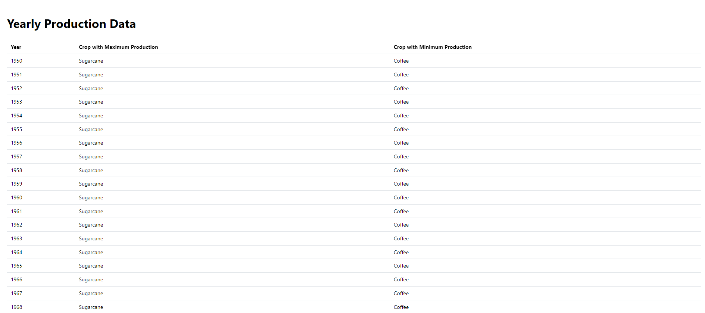
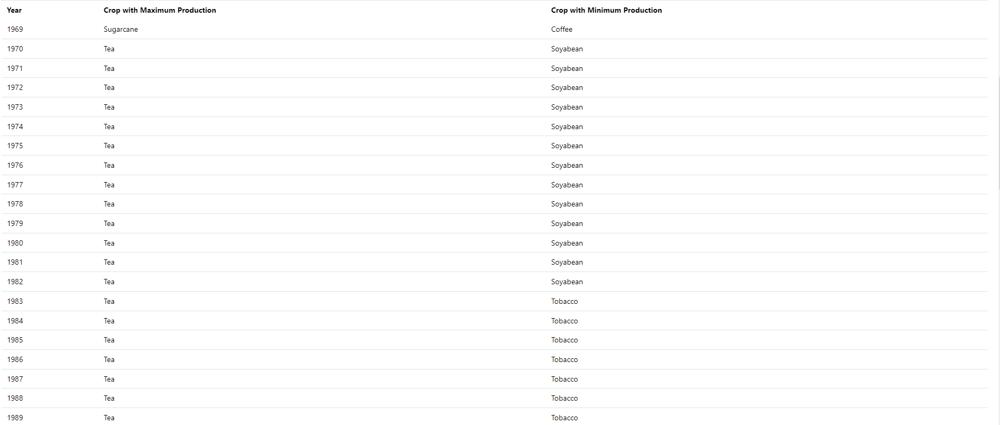
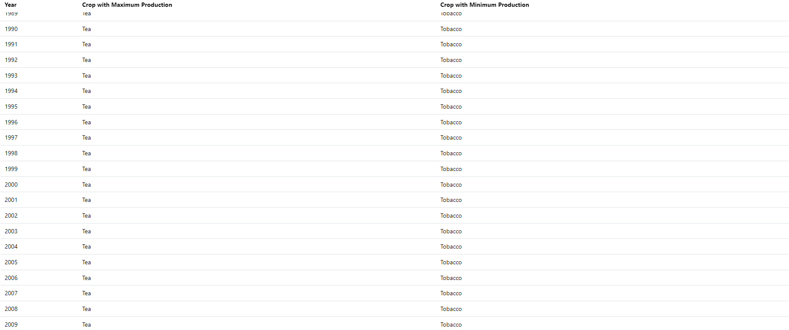
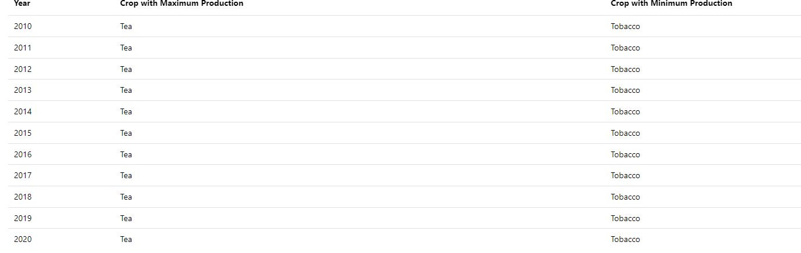
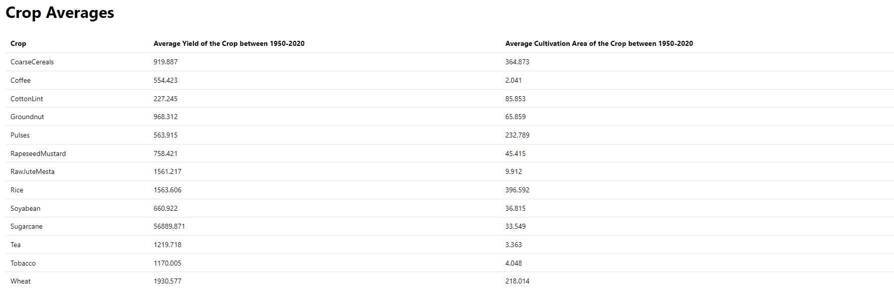

# Manufac Assignment using React + Typescript and Mantine Library

To run this project, follow these steps:

1. Install yarn
2. Add necessary packages:
    ```bash
    yarn add @mantine/core @mantine/hooks
    ```
3. Start the project:
    ```bash
    yarn start
    ```

## Screenshots

### Screenshot 1


### Screenshot 2


### Screenshot 3


### Screenshot 4


### Screenshot 5



